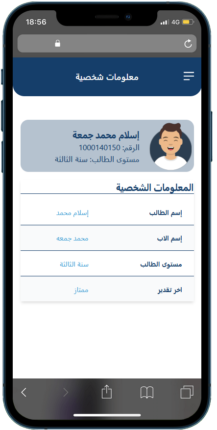

# Student Portal

This is a Student Portal built using **React**, **Vite** for fast development, **i18next** for multi-language support, and **React Router** for navigation. The portal allows students to view their personal information, timetable, and results in a user-friendly interface.

# [live demo](https://student-portal-ashy.vercel.app/).

## Features

- Multi-language support (English and Arabic)
- View student personal information
- Display timetable with course details
- View results of courses with grades and totals





## Technologies Used

- **React**: For building the user interface.
- **Vite**: For fast and optimized development and build setup.
- **React Router**: For handling routing between different views.
- **i18next**: For internationalization and supporting multiple languages.
- **Tailwind CSS**: For styling the components.
- **Vercel**: For hosting the application.

## Installation

To run this project locally, follow these steps:

1. Clone the repository:
   ```bash
   git clone https://github.com/yourusername/student-portal.git
